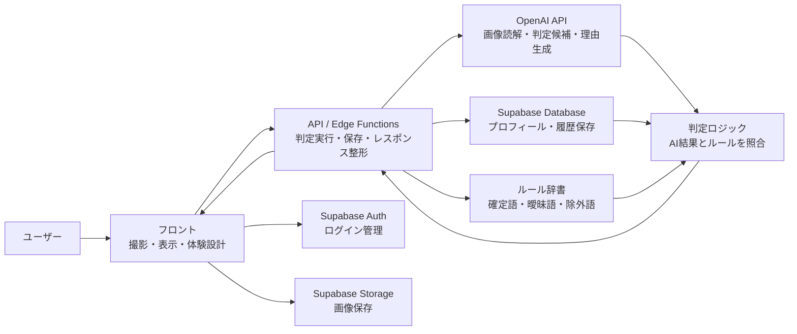
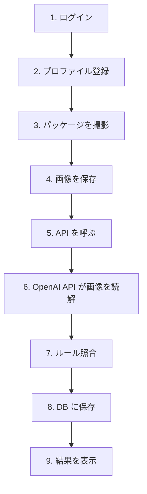
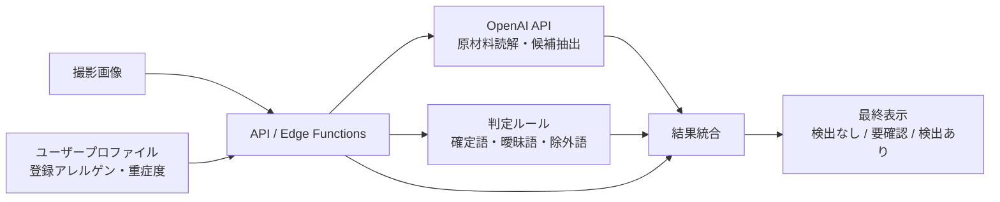

# アレルギー支援アプリ全体像

---

## この資料の役割

この資料は、このプロダクトの**全体像を説明する資料**です。

読めば次の4つがわかるようにしています。

- どんな課題を解くアプリなのか
- どんな構成で動くのか
- どこに何を置くのか
- どういう流れで使い、裏側で何が起きるのか
- なぜ今回は `OpenAI API + Supabase` を選ぶのか

時系列の通信と処理の流れは [`system-request-flow.md`](./system-request-flow.md) に、  
細かい判定ロジックは [`allergen-detection-logic.md`](./allergen-detection-logic.md) に分けています。

---

## 1. このアプリが解く課題

このアプリが向き合う課題は、単なる「食品表示を読むのが面倒」ではない。

本質は、アレルギー当事者が食品を選ぶたびに、次の3つを何度も背負っていることにある。

- **読みづらい**: 原材料欄の文字が小さく、情報量も多い
- **判断しづらい**: 代替表記や曖昧表現があり、知識があっても迷う
- **見落としが怖い**: 急いでいるときほど確認漏れが不安になる

このアプリは、その3つの負荷をまとめて減らす。

### 誰のためのアプリか

まず主な対象は、**自身が食物アレルギーを持つ成人**。

この人たちは知識がないわけではない。  
むしろ知っているからこそ、

- 毎回確認しないと不安
- グレーな表現に迷う
- 自分の判断だけに頼るのがつらい

という状態になりやすい。

### 一言でいうと

> **「自分では見落とすかもしれない危険サインを、見つけやすくしてくれるダブルチェックの相棒」**

---

## 2. このアプリが提供する体験

このアプリの価値は、画像判定そのものではなく、**確認の負担を減らす一連の体験**にある。

ユーザーが得る価値は主に5つ。

- **プロファイル登録**: 自分のアレルゲンを一度登録すれば、毎回説明しなくてよい
- **撮影だけで判定開始**: 原材料欄を撮るだけで確認を始められる
- **理由つき判定**: なぜその結果なのかがわかる
- **グレー判定**: 無理に白黒つけず、`要確認` を正直に返す
- **履歴保存**: 前に確認した商品をあとで見返せる

### MVPで最低限伝えるべき価値

- 撮影してすぐ結果が出る
- `検出なし / 要確認 / 検出あり` の3段階で返る
- ○×だけでなく理由が見える
- 過去の確認結果を覚えておける

---

## 3. 一言でわかる全体構成

このアプリは、できるだけやさしく言うと次の7つの箱でできている。

- **ユーザー**
- **フロント**
- **API / Edge Functions**
- **OpenAI API**
- **Supabase Auth**
- **Supabase Storage**
- **Supabase Database**
- **ルール辞書**
- **判定ロジック**

### 全体構成図



### 主要コンポーネント一覧

| コンポーネント | 種類 | 役割 |
|---|---|---|
| **ユーザー** | 人 | Webアプリへアクセスし、ログイン、撮影、結果確認を行う |
| **フロント** | 画面 / UI | ブラウザで動く画面。撮影、結果表示、履歴確認の入口になる |
| **Vercel** | フロント配信 | React + TypeScript をビルドした HTML / CSS / JavaScript を HTTPS 配信する |
| **API / Edge Functions** | バックエンド API | 判定依頼を受け、OpenAI 呼び出し、保存、レスポンス整形をまとめる |
| **OpenAI API** | 外部AI API | 画像や原材料表示を読み、候補や理由の材料を返す |
| **Supabase Auth** | 認証 | ログイン管理とユーザー識別を行う |
| **Supabase Storage** | ファイル保存 | 撮影画像そのものを保存する |
| **Supabase Database** | データベース | プロフィール、登録アレルゲン、履歴、画像参照先を保存する |
| **ルール辞書** | 設定ファイル | 確定語、曖昧語、除外語、文言テンプレートなどの共通ルールを持つ |
| **判定ロジック** | アプリ内ロジック | AI結果をルールと突き合わせて、安全側に整える |

### 何をどこに置くのか

| 置くもの | 置き場所 |
|---|---|
| フロントの HTML / CSS / JavaScript | `Vercel` |
| 撮影画像 | `Supabase Storage` |
| プロフィール、登録アレルゲン、履歴 | `Supabase Database` |
| ルール辞書 | 設定ファイル |
| API処理 | `Supabase Edge Functions` |

### この構成の見どころ

- AIだけで完結していない
- ログイン、保存、履歴まで一つの体験としてつながっている
- フロントから直接AIを呼ばず、API層で判定を組み立てている
- 技術を見せるためではなく、**不安を減らす体験を支えるための構成**になっている

---

## 4. フロントUIはどう実現するか

ここでいう **フロント** は、ユーザーのブラウザやスマホで開く画面のこと。

MVPでは、**専用のフロントサーバーを立てず、Vercel で静的配信するフロント + Supabase Edge Functions** で考えるのが自然です。

### 静的配信フロントを3つに分けると

今回の「静的配信フロント」は、1つの箱に見えても、中では次の3つに分かれている。

- **静的ファイル置き場**: HTML / CSS / JavaScript を置いておく場所。今回の前提では `Vercel` に配置される
- **静的ファイル配信**: そのファイルをブラウザへ届ける役割。今回の前提では `Vercel` が HTTPS 配信する
- **ブラウザ上で動くフロントロジック**: 受け取った JavaScript がユーザーの端末上で動く部分

### どう動かす想定か

- React + TypeScript で作った UI をビルドする
- できた HTML / CSS / JavaScript を `Vercel` に配置する
- `Vercel` がそのファイルを HTTPS でブラウザへ渡す
- 受け取った画面コードはブラウザ側で動く
- APIキーが必要な処理や保存処理は `Supabase Edge Functions` に寄せる
- 認証、DB、画像保存は `Supabase` を使う

### 実行イメージ

```text
Vercel
    ↓
ユーザーのブラウザ
    ↓
ブラウザ上で動くフロントUI / フロントロジック
    ↓ API呼び出し
Supabase Edge Functions
    ↓
OpenAI API / Supabase Database / Supabase Storage
```

### AWS で考えるとどう対応するか

| AWS での見え方 | 今回の資料での見え方 |
|---|---|
| `S3` | Vercel が担う静的ファイル置き場の役割 |
| `CloudFront` | Vercel が担う静的ファイル配信の役割 |
| ブラウザ | フロントロジックの実行場所 |
| `Lambda / API Gateway / EC2上のAPI` | `Supabase Edge Functions` |

### なぜ今回は Vercel が自然か

- React + TypeScript のフロントをそのまま配信しやすい
- バックエンドをほぼ `Supabase` に寄せても役割がぶつからない
- `Supabase Storage` をフロント配信に流用せず、撮影画像用として分けて説明しやすい
- 「フロントは Vercel、バックは Supabase」と切り分けた方が理解しやすい

### フロントサーバーを置かない理由

- 画面表示の多くはブラウザで完結できる
- OpenAI の APIキーをフロントに置けないので、秘密情報を使う処理だけを API層に寄せればよい
- 今回のMVPは `撮影 → 判定 → 履歴` の体験実現が主目的で、SSR専用サーバーを持つほどの要件ではない

### ではサーバーは不要なのか

それでも、**サーバー的な処理は必要**。

ただし、ここでいう「不要なのは何か」を分けて考えると分かりやすい。

- **不要**: サーバー側で毎回画面を生成する専用フロントサーバー
- **必要**: `Vercel` のような静的ファイル配信元
- **必要**: API や保存処理を受ける `Supabase Edge Functions`

必要なのは、

- 判定リクエストを受ける
- OpenAI API を呼ぶ
- ルール照合を行う
- DB や Storage に保存する

という裏側処理で、これを `Supabase Edge Functions` が担う。

### フロントサーバーが必要になるのはどんなときか

次のような要件が強くなったら、専用のフロントサーバーやSSR構成を再検討する。

- SEO を強く重視したい
- 画面をサーバー側で事前生成したい
- 画面表示前にサーバーで複雑なデータ組み立てをしたい

### 代替候補を短く言うと

- `Cloudflare Pages`: フロント静的配信の代替候補
- `S3 + CloudFront`: AWS に寄せたいときの代替候補

ただし、今回のMVPでは **Vercel + Supabase** を第一候補とするのが分かりやすい。

---

## 5. データはどこに持つのか

このアプリでは、**ユーザーごとに変わる情報**と**全員共通のルール**を分けて持つ。

### Supabase Database に持つもの

- ユーザープロフィール
- 登録アレルゲン
- 重症度
- 判定履歴
- 撮影画像の参照先

### Supabase Storage に持つもの

- 撮影画像そのもの

### ルール辞書としてファイルで持つもの

- 確定語
- 曖昧語
- 除外語
- 表示文言テンプレート

### 持ち方の方針

- **ユーザーごとに変わる情報は DB**
- **全員共通のルールはファイル**

最初は `JSON` や設定ファイルで持つのがシンプル。  
将来、管理画面から編集したくなったら、その時点でDB化を検討する。

---

## 6. バックエンドは要るのか

結論からいうと、**重い自前サーバーは必須ではないが、API層は必要**。

### API層でやること

- OpenAI API を呼ぶ
- ルール辞書と照合する
- DB に保存する
- フロント向けの結果に整形して返す

### フロントから直接 OpenAI を呼ばない理由

- APIキーをクライアントに置けない
- 判定ロジックを1か所に集めたい
- 保存処理を一元化したい

つまり、**バックエンド不要**ではなく、  
**薄い API / Edge Functions が必要**という整理になる。

---

## 7. 使う流れと、裏側で起きること

ここでは、ユーザーが初めて使って1回判定するまでを、順番に追う。

より細かい通信の順番は [`system-request-flow.md`](./system-request-flow.md) に分けています。  
ここでは全体の流れだけを短く押さえる。

### 全体フロー図



### 1. ログイン

**ユーザーにとって**
- 自分専用の設定と履歴を使えるようになる

**裏側では**
- `Supabase Auth` がユーザーを識別する

### 2. プロファイル登録

**ユーザーにとって**
- 自分のアレルゲンや重症度を最初に設定できる

**裏側では**
- `Supabase Database` に登録アレルゲンが保存される
- 次回以降は毎回入力しなくてよい

### 3. パッケージを撮影

**ユーザーにとって**
- 商品の裏面を撮るだけで判定を始められる

**裏側では**
- アプリが撮影画像を受け取り、判定の準備をする

### 4. 画像を保存

**ユーザーにとって**
- いま撮った画像がこの判定に使われる

**裏側では**
- 画像は `Supabase Storage` に保存される
- 後から履歴として見返せるようになる

### 5. API を呼ぶ

**ユーザーにとって**
- 判定が始まる

**裏側では**
- フロントが `API / Edge Functions` を呼ぶ
- API層が画像参照先、プロフィール、ルール辞書を集める

### 6. OpenAI API が画像を読解

**ユーザーにとって**
- 原材料欄をアプリが読んでくれている状態

**裏側では**
- `OpenAI API` に画像を送り、原材料やアレルゲン候補を読み取る
- どの表記が怪しいか、なぜそう見えたかの材料を返す

### 7. ルール照合

**ユーザーにとって**
- 結果が自分向けに整理される

**裏側では**
- API層がAIの結果を登録アレルゲンと照合する
- 曖昧な表現は `要確認` に寄せる
- `検出なし` を安全保証に見せないよう免責を付ける

### 8. DB に保存

**ユーザーにとって**
- 判定結果があとで見返せる状態になる

**裏側では**
- `Supabase Database` に結果、理由、撮影情報を保存する

### 9. 結果を表示

**ユーザーにとって**
- `検出なし / 要確認 / 検出あり` の3段階で結果を見る
- 理由や該当箇所も確認できる

**裏側では**
- API層がUI向けに文言、理由、注意文を整理して返す

---

## 8. 結果はどう作られるか

このアプリの重要なポイントは、**画像だけで判定していない**こと。

最終結果は次の3つを組み合わせて作る。

- **撮影画像から読めた内容**
- **その人が登録しているアレルゲン情報**
- **ルールベースの安全側補正**

### 結果生成図



### ここが大事

- 同じ商品でも、誰にとって危険かはプロフィールで変わる
- AIの読解結果をそのまま返さず、ルールで安全側に寄せる
- 結果生成そのものは API 層で行う
- だからただのOCRではなく、**個人化された確認体験**になる

---

## 9. 画面ごとの体験と裏側処理

このアプリでは、画面の体験とシステムの役割が1対1でつながっていることが大事。

| 画面・体験 | ユーザーが感じる価値 | 裏側で支える処理 |
|---|---|---|
| **ログイン画面** | 自分専用のアプリとして使える | 認証し、プロフィールと履歴をひも付ける |
| **プロフィール登録画面** | 毎回条件を入力しなくてよい | アレルゲン設定を保存する |
| **撮影画面** | 迷わずすぐ判定を始められる | 画像を受け取り保存する |
| **結果画面** | 理由つきで判断できる | API層がAI読解とルール照合結果を整形して返す |
| **履歴画面** | 前に見た商品を思い出せる | 過去の判定結果を読み出す |

### 3つの負荷をどこで減らすか

| ユーザーの負荷 | 主に解決する場所 |
|---|---|
| **読みづらい** | 撮影画面、結果画面 |
| **判断しづらい** | 結果画面 |
| **見落としが怖い** | 結果画面、履歴画面 |

---

## 10. なぜ今回は OpenAI + Supabase なのか

今回の主役は、クラウド設計の細かさではなく、**UI/UXを中心にしたプロダクト体験**。

そのため、

- `OpenAI API` で画像読解と理由生成を担う
- `Supabase` で認証・保存・履歴をシンプルにつなぐ

という構成が最も自然。

### ChatGPT と OpenAI API は何が違うのか

ここで大事なのは、**ChatGPT と OpenAI API は同じ用途ではない**ということ。

| 項目 | ChatGPT | OpenAI API |
|---|---|---|
| 何者か | 人が直接使う会話サービス | 開発者が自分のアプリに組み込むためのAPI |
| 使い方 | ブラウザやアプリで対話する | バックエンドやアプリコードから呼び出す |
| このシステムとの相性 | 単体利用には向くが、そのままではアプリの裏側処理に組み込みにくい | Edge Functions 経由でプロフィール、履歴、Storage、ルール辞書と連携しやすい |
| 向いていること | 人との会話、試行、単発の質問 | アプリ機能としての画像読解、判定補助、結果生成 |

今回必要なのは、**会話サービスそのもの**ではなく、  
**食品画像を受け取り、アプリの裏側処理に組み込めるAI機能**。

そのため、このシステムでは `ChatGPT` を直接使うより、`OpenAI API` を `Supabase Edge Functions` から呼ぶ方が自然になる。

### このシステムで OpenAI API を使うメリット

- 撮影画像を受け取り、そのまま判定処理につなげられる
- ユーザープロフィールと照合する前提で、バックエンド処理に組み込める
- ルール辞書と組み合わせて、AI結果をそのまま返さず補正できる
- 判定結果を履歴として保存できる
- UI向けの文言や理由に整形して返せる

これらは、`OpenAI API` を `Supabase Edge Functions` から呼ぶ構成だから実現しやすい。

### この構成が向いている理由

- フロントから保存までを一本の物語にしやすい
- 撮影 → 判定 → 履歴、というUXを説明しやすい
- 認証やDBを含めても構成が重くなりすぎない
- AIを「呼んだ」だけでなく、**体験に落とし込んだ設計**として見せやすい

### OpenAI API を選ぶメリットを短く言うと

- アプリに組み込める
- バックエンドから安全に呼べる
- 保存や認証とつなげられる
- 独自ロジックを前後に挟める

### ポートフォリオとして強いポイント

- きれいな画面だけで終わらない
- 判定理由の見せ方まで設計している
- 注意ヒントと判定を分けて情報設計している
- 履歴体験まで含めて、次の安心につなげている

### あえて主役にしないもの

- 重いインフラ説明
- 複数クラウドサービスの細かな比較
- 複雑すぎるAIオーケストレーション
- 企業向け監視や権限設計の深掘り

今回見せたいのは、あくまで

- 課題理解
- 情報設計
- 体験設計
- それを支える最小限の技術構成

である。

### 比較を短く整理すると

| 案 | 今回主役にしない理由 |
|---|---|
| **AWS中心構成** | 構成説明が主役になりやすく、UI/UXの話が埋もれやすい |
| **Google/Firebase寄り構成** | 低価格PoCには向くが、今回は「AIを体験に落とし込む見せ方」を優先したい |

---

## 11. 実装イメージを一言でいうと

> **フロント + API層 + Storage + DB + OpenAI** で作る。  
> ユーザー情報はDB、共通ルールは設定ファイルに置き、結果生成は API 層で行う。

---

## 12. この資料を1分で説明すると

> このアプリは、食品パッケージを撮ると、OpenAI API が原材料を読み取り、ユーザーの登録アレルゲンと照らして、`検出なし / 要確認 / 検出あり` を理由つきで返す仕組みです。  
> Supabase はログイン、画像保存、プロフィール、履歴保存を支え、API層が AI 呼び出しとルール照合を担当します。  
> つまり、AIを使った判定機能そのものよりも、**不安を減らす体験としてどう設計したか**を見せる構成です。
