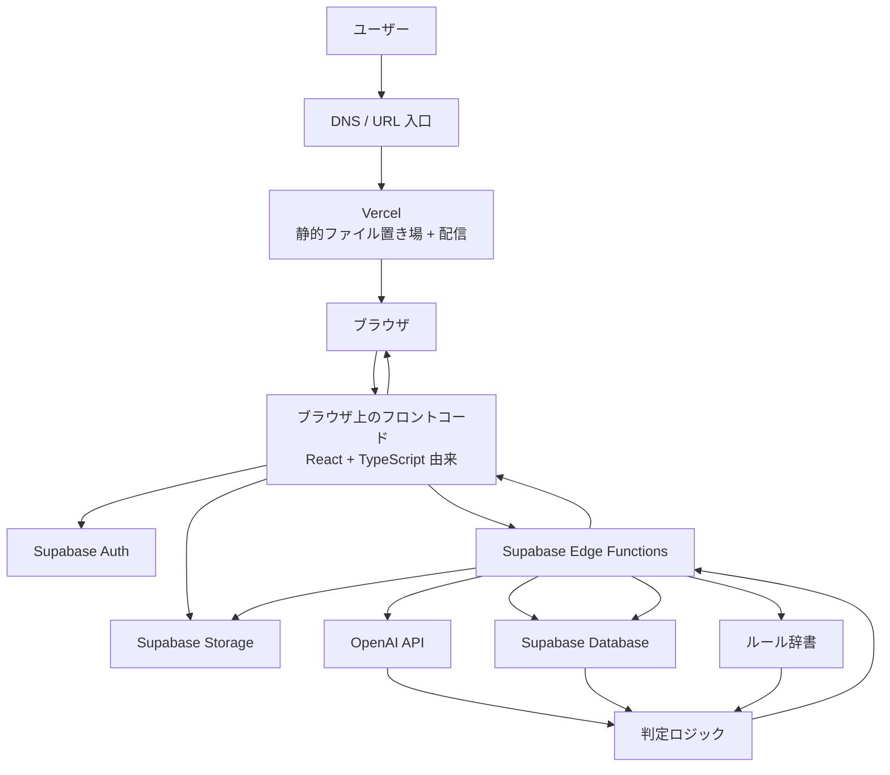

# システム全体フロー可視化

---

## この資料の役割

この資料は、[`portfolio-system-overview.md`](./portfolio-system-overview.md) や
[`system-components-catalog.md`](./system-components-catalog.md) を読んでも
まだ見えにくい、

- ユーザーは Web アプリにどうアクセスするのか
- HTTPS 通信はどこで受けるのか
- フロントコードはどこに保管され、どう表示されるのか
- Edge Functions はいつ登場し、何を処理するのか
- Supabase と OpenAI はどの順で使われるのか

を、**時系列で一本の流れとして見える化する補助資料**です。

この資料では、今回のシステムに合わせて、**フロント配信先は `Vercel` を前提** に説明します。  
必要に応じて `S3 + CloudFront` に近いイメージも補助線として使います。

---

## 1. 先に登場人物を並べる

| コンポーネント | 何者か | ここでの役割 |
|---|---|---|
| **ユーザー** | アプリを使う人 | URL にアクセスし、ログインし、撮影し、結果を見る |
| **DNS / URL 入口** | アプリのURLを解決する入口 | ユーザーを正しい配信先へ導く |
| **Vercel** | 今回のフロント配信先 | フロント成果物を置き、HTTPS でブラウザへ配る |
| **静的ファイル配信** | HTML/CSS/JS をブラウザへ返す仕組み | 今回の前提では `Vercel` がこの役割を担う |
| **静的ファイル置き場** | フロントのビルド成果物を保管する場所 | 今回の前提では `Vercel` 上にある保管先にあたる |
| **ブラウザ** | ユーザーの端末上のアプリ実行環境 | 受け取ったフロントコードを実行する |
| **ブラウザ上のフロントコード** | React + TypeScript 由来の画面コード | ログイン画面、撮影画面、結果画面を動かす |
| **Supabase Auth** | 認証サービス | ログインやユーザー識別を担当する |
| **Supabase Edge Functions** | バックエンド API 処理 | 判定依頼を受け、AI呼び出しや保存処理を行う |
| **Supabase Database** | データベース | プロフィール、履歴、画像参照先などを保存する |
| **Supabase Storage** | ファイル保存先 | 撮影画像を保存する |
| **OpenAI API** | AIサービス | 画像や原材料表示を読み取り、候補と理由の材料を返す |
| **ルール辞書** | 共通ルールの設定 | 確定語、曖昧語、除外語、文言テンプレートを持つ |
| **判定ロジック** | アプリ独自の処理 | AI結果を安全側に整えて最終判定を作る |

---

## 2. 全体の時系列フロー図



---

## 3. まず、最初の画面が出るまで

### ざっくり図

```text
ユーザー
  ↓ URLにアクセス
DNS / URL 入口
  ↓
Vercel
  ↓ HTML/CSS/JS を返す
ブラウザ
  ↓
ブラウザ上でフロントコードを実行
  ↓
ログイン画面などが表示される
```

### 流れを箇条書きで書く

1. ユーザーが Web アプリの URL にアクセスする。
2. URL は DNS などの仕組みで、正しい `Vercel` の配信先へ導かれる。
3. HTTPS 通信は、まず **Vercel** 側で受ける。
4. `Vercel` は、必要な HTML / CSS / JavaScript を返す。
5. そのファイルの元データは、今回の前提では **Vercel 上の静的ファイル置き場** に保管されている。
6. ブラウザは返ってきた JavaScript を読み込み、React + TypeScript 由来のフロントアプリを実行する。
7. その結果、ログイン画面や初期画面が表示される。
8. この段階では、**Supabase Edge Functions はまだ画面を返していない**。

### ここで大事なこと

- 画面を実際に表示しているのは **ブラウザ**
- 画面の元ファイルを返しているのは **Vercel**
- フロントコードの保管先は **Vercel 上の静的ファイル置き場**
- Edge Functions は、この段階ではまだ「画面表示担当」ではない

### AWSでたとえると

| 役割ベースの見え方 | AWSで近いイメージ |
|---|---|
| `Vercel` が担う静的ファイル置き場 | `S3` |
| `Vercel` が担う静的ファイル配信 | `CloudFront` |
| ブラウザ上のフロント実行 | ユーザーのブラウザ |

---

## 4. ログインから判定結果表示まで

### ざっくり図

```text
ブラウザ上のフロントコード
  ↓ ログイン要求
Supabase Auth
  ↓ 認証結果
ブラウザ上のフロントコード
  ↓ 撮影・画像アップロード
Supabase Storage
  ↓ 判定依頼
Supabase Edge Functions
  ↓
OpenAI API / Database / ルール辞書 / 判定ロジック
  ↓
Supabase Database に保存
  ↓
ブラウザへ結果返却
  ↓
結果画面を表示
```

### 流れを箇条書きで書く

1. ログイン画面での入力は、ブラウザ上のフロントコードが受け取る。
2. フロントコードは `Supabase Auth` と HTTPS 通信し、ログインを行う。
3. 認証が成功すると、ユーザーは自分専用の設定と履歴にアクセスできる状態になる。
4. ユーザーは撮影画面で画像を撮るか、画像を選択する。
5. 画像データはブラウザで保持され、必要に応じて `Supabase Storage` に保存される。
6. フロントコードは、画像参照先やプロフィール情報を使って `Supabase Edge Functions` に判定リクエストを送る。
7. HTTPS 通信は、このとき **Edge Functions 側** でも受けられる。
8. Edge Functions は必要な情報を集める。
9. `Supabase Database` からプロフィールや過去データを参照する。
10. `ルール辞書` を読み取り、判定に使う共通ルールを準備する。
11. `OpenAI API` を呼び出し、画像や原材料表示の読み取り結果を得る。
12. `判定ロジック` が AI 結果、ユーザー情報、ルール辞書を組み合わせて最終判定を作る。
13. Edge Functions は結果、理由、撮影情報などを `Supabase Database` に保存する。
14. Edge Functions はフロント向けの JSON レスポンスを返す。
15. ブラウザ上のフロントコードがその結果を受け取り、結果画面を描画する。
16. ユーザーは `検出なし / 要確認 / 検出あり` と理由、注意文を見る。

### ここで大事なこと

- ログイン処理は **Supabase Auth**
- 画像保存は **Supabase Storage**
- 判定 API は **Supabase Edge Functions**
- 画面更新は **ブラウザ上のフロントコード**
- 結果画面は、Edge Functions が HTML を返しているのではなく、**ブラウザが JSON を受けて描画している**

---

## 5. 全体フローを一本で書く

1. ユーザーが Web アプリの URL にアクセスする。
2. DNS / URL 入口が、`Vercel` へ導く。
3. `Vercel` が HTTPS を受け、配置された HTML/CSS/JS をブラウザへ返す。
4. ブラウザが React + TypeScript 由来のフロントコードを実行し、ログイン画面を表示する。
5. ユーザーがログインすると、フロントコードが Supabase Auth と通信する。
6. ユーザーが画像を撮影または選択する。
7. 必要に応じて画像は Supabase Storage に保存される。
8. フロントコードが Supabase Edge Functions に判定依頼を送る。
9. Edge Functions が Database、Storage、ルール辞書、OpenAI API を使って判定を組み立てる。
10. 判定ロジックが最終結果を作る。
11. Edge Functions が結果を Database に保存し、JSON をフロントへ返す。
12. ブラウザ上のフロントコードがその JSON を使って結果画面を表示する。

---

## 6. 誤解しやすい点を先に潰す

- **Edge Functions にフロント画面コードを書くわけではない**
- **フロントコードは `Vercel` に静的ファイルとして保管・配信される**
- **フロントロジックはブラウザで実行される**
- **Edge Functions は API 処理と秘密情報を扱う場所**
- **Supabase Storage は撮影画像用であり、フロント静的ファイル置き場とは別概念**
- **最初の画面は Edge Functions が返しているのではなく、`Vercel` + ブラウザ実行で表示される**

---

## 7. 一言でまとめると

このシステムは、

- 最初の画面は **Vercel + ブラウザ実行**
- ログインは **Supabase Auth**
- 画像保存は **Supabase Storage**
- 判定処理は **Supabase Edge Functions**
- AI読解は **OpenAI API**
- プロフィールと履歴保存は **Supabase Database**

という分担で動いている。

つまり、**最初に画面を出す流れ** と **その後にAPIで裏側処理をする流れ** が分かれている、と理解すると整理しやすい。
